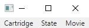

# NesSharp

This is a copy of the original repository, which can be found at [GitLab](https://gitlab.com/nes-devteam/nessharp).

## Summary

NesSharp is an NES emulator created in C#. It is capable of running a fair deal of roms (to be exact the games that run on mappers 0, 1, 2, 4, 7, 11). You can play back movie files from bizhawk and FCEUX. Moreover, you can save the state of the NES and load it back using the state menu. Lastly, games that have a battery -- like the legend of zelda -- will remember their state on a reload.

## Building

### Prerequisites

**Windows:**

You need the dotnet sdk 3.1 to be installed -- if you have the latest visual studio, then you should be fine. If you have visual studio, the rest of the dependencies will be installed once you open the project. 

**Unix:**

You need `dotnet-sdk-3.1`, `SFML` and `CSFML` to be installed on your system. Most package managers have packages for these, so it is just a matter of running

```bash
sudo pacman -S dotnet-sdk-3.1 csfml
# pacman has a package for dotnet

sudo apt install libcsfml-dev
# Install dotnet via https://docs.microsoft.com/en-us/dotnet/core/install/linux
```

### Building

**Windows:**

Open visual studio, and click "Clone a repository". Enter `https://gitlab.com/nes-devteam/nessharp.git` in the text field "repository location" and click the "Clone" button. Once visual studio has fully loaded the project, click the solution file in the solution explorer. Then build the whole solution via Build > Build Solution. Open the NesSharp.Wpf project in file explorer and browse to the folder `NesSharp.Wpf/bin/Release/netcoreapp3.1` and open the executable `Nessharp.Wpf.exe`.

**Unix:**

Execute the following set of commands

```bash
git clone https://gitlab.com/nes-devteam/nessharp.git && cd nessharp
dotnet run --project NesSharp.Gtk # Command for linux with X11
dotnet run --project NesSharp.Mac # Command for mac
```

> **Disclaimer:** Even though there is a folder for mac, we do not actively support it. i.e. we could not get the mac version to work with both M1 and x86 macs.

### Running

Once you run the executable, you see the following screen



In the "Cartridge" menu, you can load a rom via the "Open" button or close the current playing session with the "Close" button.

In the "State" menu, you can save the current state of the NES, a new file will be created in the same folder as the rom file which mustn't be renamed. You can also load the state of the NES when playing a game, then the save file is loaded from the same folder the rom is stored in.

In the "Movie" menu, the "Play" button asks for a movie file and plays that movie file. Movie files with the extension .fm2 and the unzipped `Input Log.txt` in a .bk2 file are supported. The "Stop" button stops the execution of the current movie.
